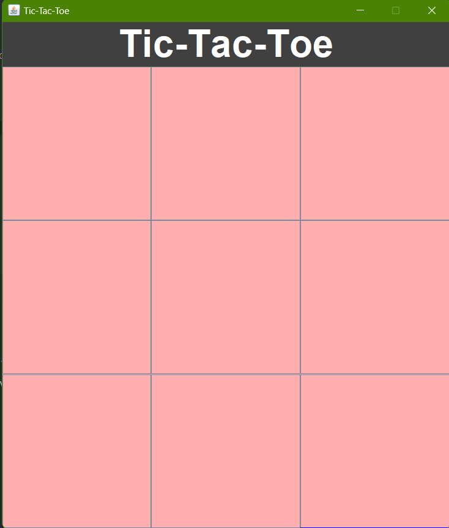
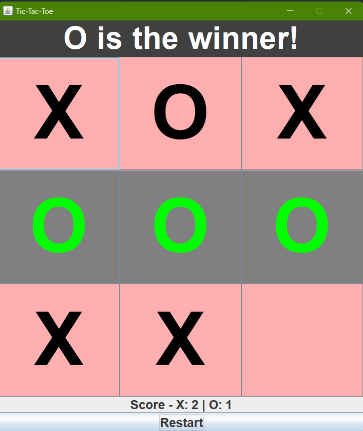
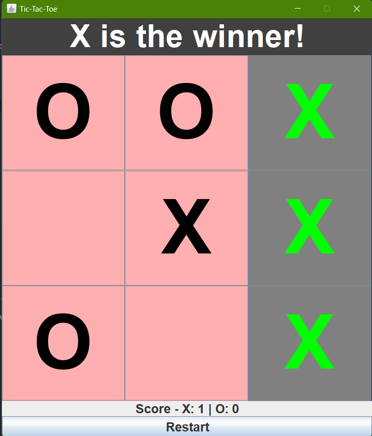
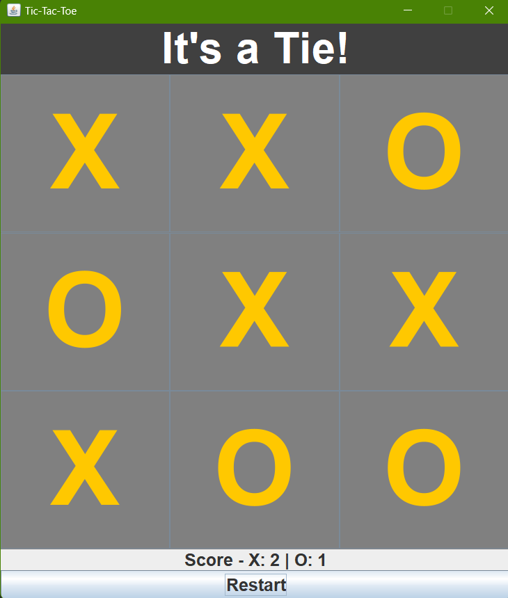

# Project Title


# Tic-Tac-Toe Game

This is a Java implementation of the classic Tic-Tac-Toe game with a graphical user interface built using Swing.

## Features

- **Player vs Player mode:** Play against a friend on the same computer.
- **Score tracking:** Keep track of scores for Player X and Player O.
- **Turn indicator:** Display whose turn it is during the game.
- **Winning highlight:** Highlight the winning combination on the board.
- **Tie detection:** Detect and display when the game ends in a tie.
- **Restart button:** Reset the game board and start a new round.

## How to Run

1. Ensure you have Java installed on your system.
2. Compile the `TicTacToe.java` file.

```sh
javac TicTacToe.java
```
3. Run the compiled class file.

```bash
java TicTacToe

```


## Main Components
- `JFrame`: The main window frame for the game.
- `JPanel`: Organize different sections (text panel, board panel, score panel).
- `JLabel`: Displays the game title and scores.
- `JButton`: Represent the Tic-Tac-Toe grid and restart button

## Game Logic
- The 3x3 game board uses `JButton` objects.
- `CurrentPlayer` variable tracks whose turn it is.
- `checkWinner` method determines if there's a winner or a tie after each move.
- `resetGame` method  resets the board and game variables for a new round.
- `updateScore` and `updateScoreLabel` methods handle the scoring system.
## **Screenshots**
### Initial Screen


### Player O Wins


### Player X Wins


### Tie Game

## License

This project is open source and available under the [MIT License](https://choosealicense.com/licenses/mit/)


## Acknowledgements

 - Inspired by the classic Tic-Tac-Toe game.
 - Developed using Java and Swing for the GUI.

